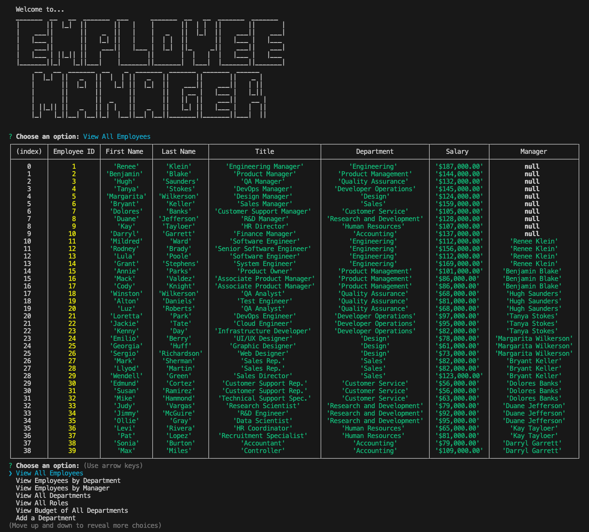
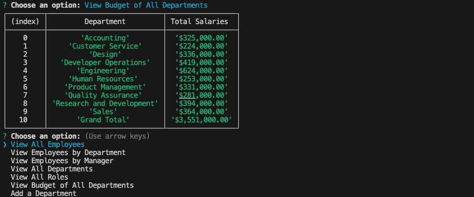

# Employee Manager

[](https://opensource.org/licenses/MIT)

[Link to video presentation](https://drive.google.com/file/d/1VCjXRG1KMkOjtnAXNE8ggArvGgP9N80_/view)

## Description
This employee management system is a command-line application designed to assist business owners in organizing and planning their companies by efficiently managing departments, roles, and employees. It provides a user-friendly interface that allows for easy viewing and manipulation of essential company data.

## Table of Contents
- [Installation](#installation)
- [Usage](#usage)
- [Badges](#badges)
- [Features](#features)
- [Questions](#questions)

## Installation
1. **Clone the Repository**
    ```
    git clone https://github.com/your/repository.git
    cd employee-management-system
    ```
2. **Install Dependencies**
    ```
    npm i
    ```
    **Dependencies**

    - This application utilizes Node.js along with the following key dependencies:
    ```
    mysql: ^2.18.1
    inquirer: ^8.2.4
    ```
3. **Database Setup**
   - Schema Creation: Run the schema.sql file provided in the db directory to create the necessary tables for the application. You can execute this SQL script in your MySQL environment directly or use commands like:
   ```
    mysql -u your_username -p
    < source db/schema.sql
   ```
   - Seed Initial Data: Run the seeds.sql file to populate your tables with initial data required for the application. Execute this SQL script in a similar way as the schema:
   ```
    < source db/seeds.sql
   ```
4. **Configuration**
    - Update the connection settings in the config/connection.js file to match your MySQL database credentials.

## Usage

1. Run the Application

    - After following the installation instructions, execute the application by running the following command:

    ```
    node index.js
    ```
2. Using the application:
   - Upon starting the application, you'll be presented with a menu of options to manage your company's data.

    - Select from various actions such as viewing departments, roles, and employees, adding or deleting departments, roles, and employees, and updating employee information.

    

    - Navigate through the prompts and menus using the arrow keys and Enter key to make your selections.

    

3. Quitting the Application:

    - To exit the application, select the "Quit" option from the main menu.0


## Badges


## Features
**View and Manage Data:** Access and manage departments, roles, and employees, enabling additions, updates, and deletions. Comprehensive error handling ensures a smooth experience even during unexpected events.

**Department Insights:** Gain detailed department overviews, including names, IDs, and total utilized budget calculated from combined salaries. Robust error handling guarantees accurate insights regardless of data anomalies.

**Employee Data Management:** Easily add new employees, roles, and departments, and perform updates such as role modifications and manager assignments. Error handling mechanisms provide a seamless process, even in cases of data inconsistencies.

**Efficient Access:** Navigate team structures effortlessly by viewing employees based on their managers or departments. Careful error handling ensures accurate hierarchies and reporting structures even in complex scenarios.

**Enhanced Functionality:** Additional features such as viewing the total utilized budget of a department and updating employee managers are supported by resilient error handling to maintain data integrity and application stability.

**Error Handling**
The application is equipped with robust error handling mechanisms to address potential issues that may arise during usage. Error messages and prompts are implemented to guide users in case of invalid inputs, database connectivity problems, or unexpected scenarios. This ensures a smooth and reliable user experience, providing informative feedback and guiding users on how to resolve encountered issues.

## Questions
[GitHub Profile](https://github.com/ltrokey)

Please feel free to contact me via the email link below.

[Email](mailto:trokeyln@gmail.com)
